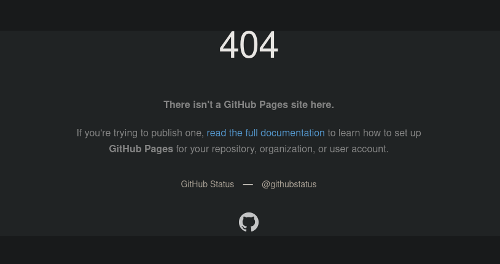

# Pages 404
> A Firefox Add-On (Chrome support soon!)

Get the Add-On on [Firefox Add-ons](https://addons.mozilla.org/en-US/firefox/addon/gh-pages-404/)

## What is this new piece of Javascript

This Firefox Add-On assists you when you encounter a dead github.io page. Let's say you found some `*.github.io` link on some blog,
and the page shows

Maybe the owner moved the pages url, or maybe moved the repo? In order to find it, you must search for the user (from the url of the page) on GitHub
and browse for the repo. If you know url juggling, you may swap things in url to get to the GitHub profile directly, and that is exactly what is Add-On does!
It provides two links on the page, one for the user's GitHub profile, and other for the page's repository!

You can still do that manually, but I created this add-on to aid myself, and it may help you too!

## For Google Chrome (and other chromium based browsers)
For now you have to manually download the extension manually (use git clone or download as zip), unzip it to some safe place,
go to `chrome://extensions`, enable developer mode and click `Load Unpacked` and select the folder to which you extracted the extension.

You need to repeat these steps manually for each release, since Google now disallows installation of local `.crx` files _directly_ to _protect_
the users.
